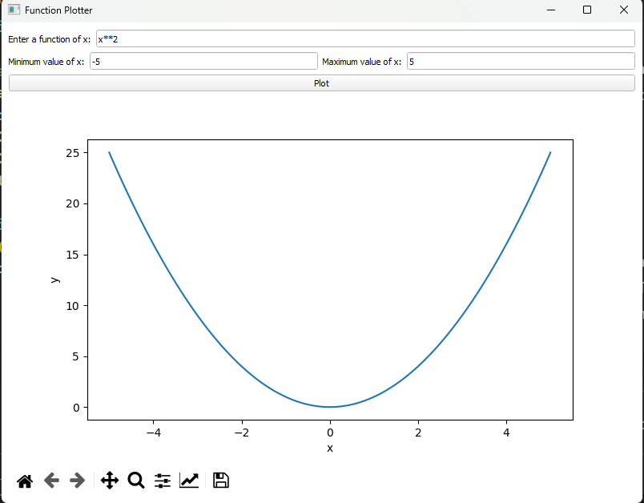
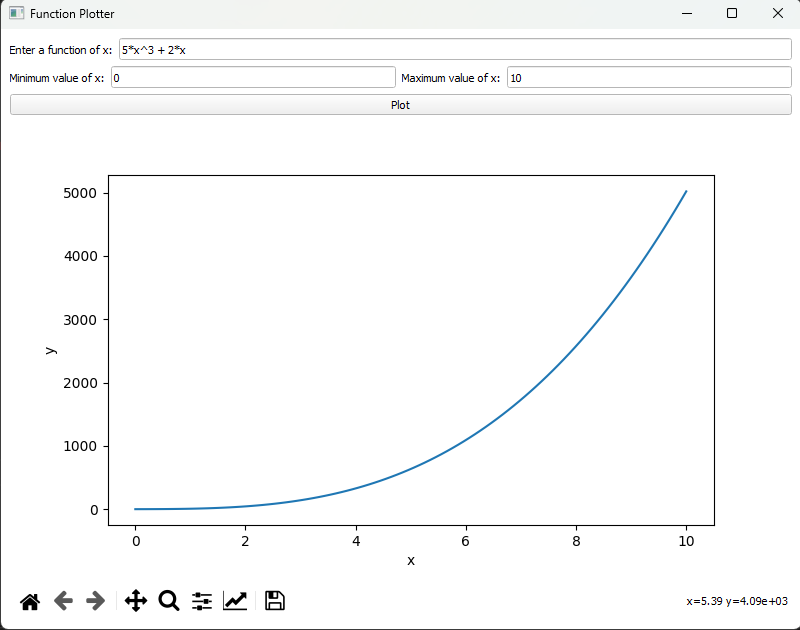
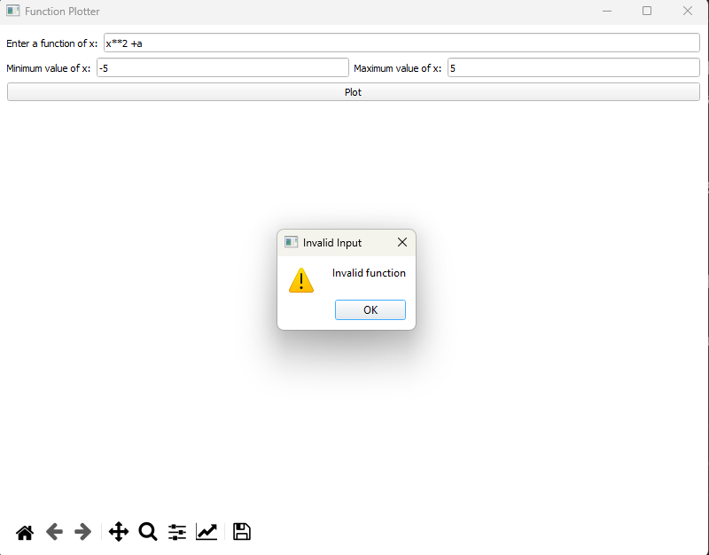
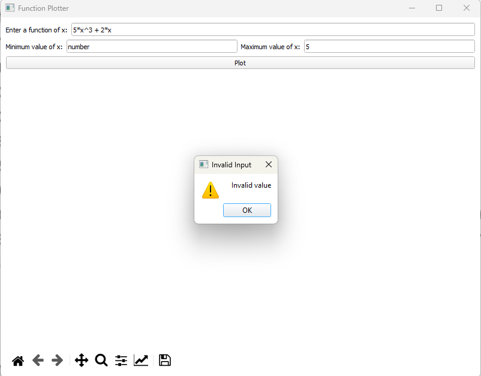
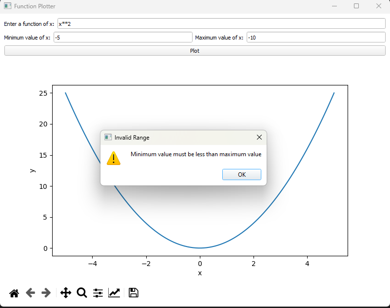

# Function Plotter

Function Plotter is a simple application that allows you to plot mathematical functions using the PySide2 and Matplotlib libraries.

## Installation

1. Make sure you have Python 3.9 or later installed.
2. Install the required dependencies by running the following command:
   ```shell
   pip install PySide2 matplotlib 
## Usage

Run the `function_plotter.py` script to launch the application:
   ```shell
   python function_plotter.py
   ```

Enter a valid mathematical function, along with the minimum and maximum values of x, and click the "Plot" button to visualize the function.

## Features

The Function Plotter is a Python GUI application that allows users to plot arbitrary functions of x. It provides the following features:

1. **User-Entered Function**: Users can enter a function of x, supporting basic arithmetic operators (+, -, *, /) and exponentiation (^).
2. **Dynamic Plotting**: The application dynamically plots the entered function based on user inputs.
3. **Input Validation**: The user input for the function and x range values is validated to ensure they meet the required format and constraints.
4. **Error Messages**: If there are any errors in the user input, appropriate error messages are displayed to guide the user.
5. **Matplotlib Integration**: The application utilizes Matplotlib to generate the function plot and embeds the plot within the GUI.
6. **Scalability**: The GUI layout is designed to scale proportionally as the application window is resized, providing an optimal user experience across different screen sizes.
7. **Navigation Toolbar**: The Matplotlib plot includes a navigation toolbar with interactive features such as zooming and panning.
8. **Modern GUI**: The application uses the PySide2 library for creating a modern and visually appealing graphical user interface.


## Examples

### Working Example 1



In this example, we have entered the function `x**2`, with a minimum value of `-5` and a maximum value of `5`. The application successfully plots the function.

### Working Example 2



In this example, we have entered the function `5*x^3 + 2*x`, with a minimum value of `0` and a maximum value of `10`. The application successfully plots the function.

### Wrong Example 1



In this example, we have entered an invalid function `x**2 + a`. The application displays an error message indicating that the function is invalid.

### Wrong Example 2



In this example, we have entered an invalid min value `number`. The application displays an error message indicating that the value is invalid.

### Wrong Example 3



In this example, we have entered a max value of x that is less than min value of x `min x = -5, max x = -10`. The application displays an error message indicating that max value of x is less than min value of x.

## License

This project is licensed under the [MIT License](LICENSE).


